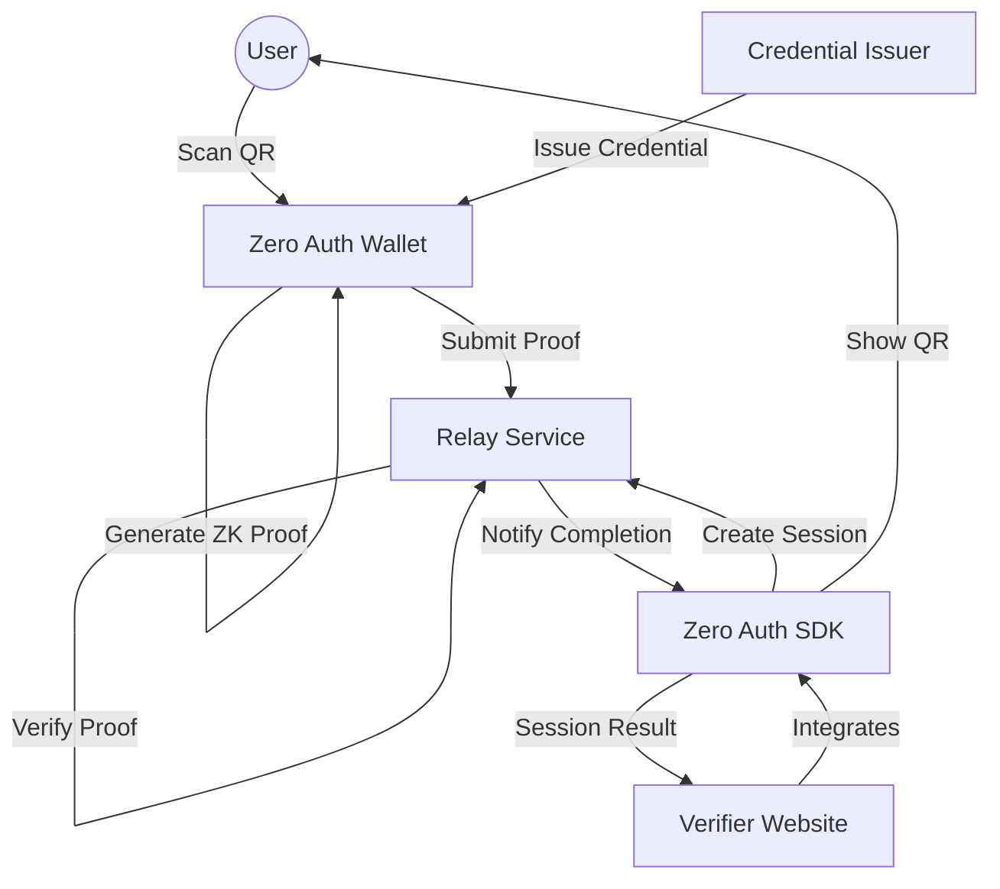

# Architecture

> Auto-generated by /map on 2026-02-15

## Overview

Zero Auth is a decentralized, passwordless authentication ecosystem. It leverages Zero-Knowledge Proofs (ZKPs) to allow users to prove identity claims (like age or status) without revealing underlying private documents.

## Components

### 1. Zero Auth Wallet (`zero-auth-wallet/`)
- **Purpose**: Mobile app for storing credentials and local ZK proof generation.
- **Location**: `zero-auth-wallet/`
- **Key Files**: 
    - `lib/proof.ts`: ZK proof generation logic (using `snarkjs`).
    - `lib/hashing.ts`: Poseidon hashing implementation.
    - `store/auth-store.ts`: Secure local storage for credentials.
- **Dependencies**: React Native (Expo), Snarkjs, Circomlibjs.

### 2. Zero Auth Relay (`zero-auth-relay/`)
- **Purpose**: Stateless coordinator that manages sessions and provides server-side ZK verification.
- **Location**: `zero-auth-relay/`
- **Key Files**:
    - `src/index.ts`: Express API for session management.
    - `src/lib/verifier.ts`: Proof verification using `snarkjs`.
    - `src/lib/redis.ts`: Session persistence.
- **Dependencies**: Node.js, Express, Redis, Snarkjs.

### 3. Zero Auth SDK (`zero-auth-sdk/`)
- **Purpose**: Lightweight library for verifiers to integrate "Login with Zero Auth".
- **Location**: `zero-auth-sdk/`
- **Key Files**:
    - `src/index.ts`: Core `ZeroAuth` class for session creation and status polling.
- **Dependencies**: TypeScript.

## Data Flow

1. **Session Creation**: SDK requests Relay to create a session for a specific "claim" (e.g., age > 18).
2. **Challenge Generation**: Relay generates a unique `nonce` and `session_id`.
3. **QR Emission**: SDK displays a QR code containing the `session_id`, `nonce`, and relay callback URL.
4. **Local Proof Generation**: Wallet scans QR, retrieves local credential salt, and computes a ZK proof for the claim.
5. **Submission**: Wallet POSTs the ZK proof to the Relay callback URL.
6. **Verification**: Relay verifies the proof against the circuit's `vKey`.
7. **Polling Completion**: SDK polling detects the `COMPLETED` status and reveals the success to the verifier.

## Technical Debt

- **Poseidon Optimization**: Current implementation in the wallet uses an unoptimized JS fallback due to WebAssembly constraints in React Native (Hermes).
- **Hardcoded Configs**: Relay URL and other parameters are often hardcoded in the wallet/sdk.
- **Missing Issuance Flow**: Credential issuance is currently mocked or requires manual entry in the wallet.
- **Polyfill Complexity**: Wallet uses aggressive global polyfills for `buffer`, `crypto`, and `WebAssembly` to support `snarkjs`.

## Conventions

- **Naming**: CamelCase for classes, kebab-case for directories, snake_case for API payloads.
- **Structure**: Feature-based separation in the wallet; Layered architecture in the relay.
- **Testing**: Currently limited; automated E2E tests for the whole flow are missing.
